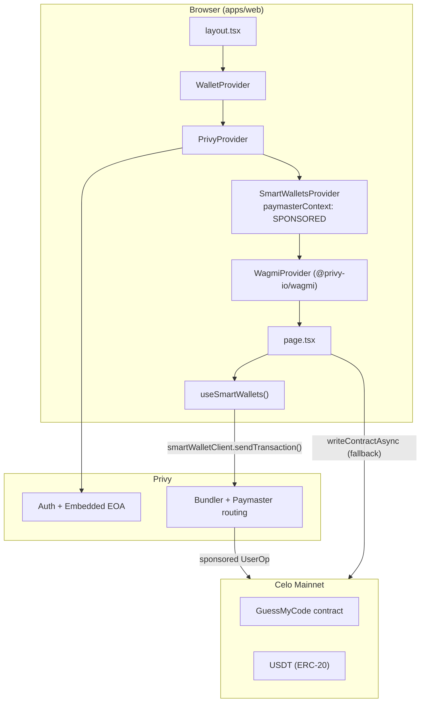

# Privy + Gas Sponsorship Integration

This document describes how **Crack-My-Code** (`apps/web`) integrates [Privy](https://docs.privy.io/) for authentication and embedded wallets, and uses Privy **smart wallets** with **gas sponsorship** so users can submit on-chain transactions without holding CELO for gas.

---

## Overview

The app uses a two-layer wallet stack:

1. **Privy** — sign-in, embedded EOA wallets, and Wagmi integration.
2. **Privy Smart Wallets (ERC-4337)** — account-abstraction transactions routed through a paymaster that sponsors gas.

Gas sponsorship is configured in two places:

| Layer | Where | What it does |
|-------|--------|--------------|
| **Dashboard** | Privy Dashboard → Smart Wallets → Paymaster URL | Registers the bundler/paymaster provider (e.g. Pimlico, Alchemy, Biconomy) that actually pays gas |
| **SDK** | `SmartWalletsProvider` in `wallet-provider.tsx` | Sets `paymasterContext` so each user operation is sent in `SPONSORED` mode |

On-chain actions in the main UI prefer `smartWalletClient.sendTransaction()` when a smart wallet is available. That path is gasless for the user. A Wagmi fallback (`writeContractAsync`) is used when no smart wallet client exists (e.g. MiniPay or Farcaster injected wallets).

---

## Architecture



**Separate path (not Privy):** The AI agent uses a server-side Pimlico smart account in `blockchain/SmartAccount.ts` and `blockchain/AgentWallet.ts`. That is independent of user-facing Privy gas sponsorship.

---

## Dependencies

From `apps/web/package.json`:

| Package | Role |
|---------|------|
| `@privy-io/react-auth` | Auth UI, embedded wallets, `SmartWalletsProvider`, `useSmartWallets` |
| `@privy-io/wagmi` | Bridges Privy sessions to Wagmi (`createConfig`, `WagmiProvider`) |
| `wagmi` / `viem` | Chain reads, contract encoding, transaction receipts |
| `permissionless` | Used only for the **server-side** agent Pimlico client, not for Privy smart wallets |

---

## Environment variables

Required in `apps/web/.env` (not committed; see `.env.template` for other vars):

| Variable | Purpose |
|----------|---------|
| `NEXT_PUBLIC_PRIVY_APP_ID` | Privy application ID |
| `NEXT_PUBLIC_PRIVY_CLIENT_ID` | Privy client ID (passed to `PrivyProvider`) |

If `NEXT_PUBLIC_PRIVY_APP_ID` is missing or invalid, `WalletProvider` skips Privy entirely and renders children with only React Query — wallet features are disabled.

**Dashboard-side (not in repo):** Paymaster URL, smart wallet type (Safe/Kernel/etc.), and sponsorship spend limits are configured in the [Privy Dashboard](https://dashboard.privy.io/) under Smart Wallets settings. See [Privy: Gas sponsorship with paymasters](https://docs.privy.io/wallets/gas-and-asset-management/gas/ethereum#gas-sponsorship-with-paymasters).

**Agent-only (server):** `PIMLICO_API_KEY` and `AGENT_PRIVATE_KEY` power the bot wallet in `blockchain/SmartAccount.ts` — not end-user Privy flows.

---

## Provider setup

The wallet stack is mounted in `src/app/layout.tsx`:

```tsx
<FarcasterProvider>
  <WalletProvider>
    {children}
  </WalletProvider>
</FarcasterProvider>
```

### `PrivyProvider`

Defined in `src/components/wallet-provider.tsx`:

- **Chain:** Celo mainnet only (`defaultChain: celo`, `supportedChains: [celo]`).
- **Embedded wallets:** Created on login for users who do not already have a wallet (`createOnLogin: 'users-without-wallets'`).
- **Appearance:** Dark theme, accent `#00CFFF`, social login first (`showWalletLoginFirst: false`).

### `SmartWalletsProvider` (gas sponsorship config)

Wrapped inside `PrivyProvider`:

```tsx
<SmartWalletsProvider
  config={{
    paymasterContext: {
      mode: 'SPONSORED',
      calculateGasLimits: true,
    }
  }}
>
```

- **`mode: 'SPONSORED'`** — Tells the configured paymaster to sponsor gas for user operations (Biconomy-style context; Privy also documents similar overrides for Alchemy policies).
- **`calculateGasLimits: true`** — Lets the paymaster/SDK compute gas limits for the UserOp.

Privy routes transactions to the paymaster URL registered in the dashboard; the SDK context above controls sponsorship behavior per request.

### Wagmi integration

`@privy-io/wagmi`'s `createConfig` wires Celo with:

- `farcasterFrame()` — Farcaster Mini App connector
- `injected()` — MiniPay and other injected wallets

Auto-connect logic detects MiniPay (`window.ethereum.isMiniPay`) or Farcaster (Frame SDK / URL hints) and connects without requiring a Privy login spinner.

### SSR / hydration guard

`WalletProvider` waits for client mount before rendering Privy hooks, avoiding SSR crashes. Invalid/missing app ID degrades gracefully without Privy.

---

## Consuming smart wallets in the app

### Hook

`src/app/page.tsx` uses Privy's smart wallet client:

```tsx
import { useSmartWallets } from '@privy-io/react-auth/smart-wallets';

const { client: smartWalletClient } = useSmartWallets();
```

When `smartWalletClient` is defined, the user has an active Privy smart wallet and sponsored sends are available.

### Transaction pattern

All sponsored sends follow the same pattern:

1. Encode calldata with `encodeFunctionData` (viem).
2. Call `smartWalletClient.sendTransaction({ to, data, value })`.
3. Wait for receipt via `publicClient.waitForTransactionReceipt`.

If `smartWalletClient` is **null**, the same action falls back to Wagmi `writeContractAsync` (user pays gas from their connected EOA).

Example from wallet send (USDT transfer):

```tsx
if (smartWalletClient) {
  const data = encodeFunctionData({
    abi: ERC20_TRANSFER_ABI,
    functionName: 'transfer',
    args: [sendAddress, amount],
  });
  const txHash = await smartWalletClient.sendTransaction({
    to: USDT_ADDRESS,
    data,
    value: BigInt(0),
    type: 'legacy',
  });
  await publicClient.waitForTransactionReceipt({ hash: txHash });
} else {
  await writeContractAsync({ address: USDT_ADDRESS, abi, functionName: 'transfer', args: [...] });
}
```

---

## On-chain actions using gas sponsorship

These flows in `src/app/page.tsx` use `smartWalletClient` when available:

| Action | Contract function | Notes |
|--------|-------------------|--------|
| Send CELO (ERC-20) | `transfer` on native CELO token address | Uses `type: 'legacy'` |
| Send USDT | `transfer` on `USDT_ADDRESS` | 6 decimals |
| Create challenge | `createChallenge(isPaid, stakeAmt)` | Called during matchmaking for non-AI modes |
| Join challenge | `joinChallenge(challenger)` | Paid (`cash`) joins only |
| Cancel challenge | `cancelChallenge(matchId)` | Used in `handleCancelChallenge` |

Contract and token addresses live in `blockchain/constants.ts`:

- **GuessMyCode:** `0x0317e55136a46557516aa40EA96d66772767C72C`
- **USDT (Celo):** `0x48065fbbe25f71c9282ddf5e1cd6d6a887483d5e`

---

## Auth and address resolution

`src/app/page.tsx` and `src/components/connect-button.tsx` resolve the active address as:

```tsx
const { address: wagmiAddress, isConnected } = useAccount();
const { authenticated, user } = usePrivy();
const address = wagmiAddress || user?.wallet?.address;
```

- **Privy sign-in:** User gets embedded wallet + smart wallet; sponsored txs go through the smart wallet client.
- **MiniPay / Farcaster auto-connect:** Wagmi connects via injected/Farcaster connector; typically **no** `smartWalletClient` → user pays their own gas.
- **Connect UI:** `ConnectButton` calls `login()` for standard web users; shows a connecting state in MiniPay/Farcaster while auto-connect runs.

---

## Flows that do **not** use gas sponsorship today

These still use Wagmi `useWriteContract` directly and do **not** branch on `smartWalletClient`:

| Location | Action |
|----------|--------|
| `src/components/Lobby.tsx` | USDT `approve` before creating a cash challenge |
| `src/components/JoinStakeModal.tsx` | USDT `approve` before joining a paid challenge |
| `blockchain/hooks.ts` | `approveUsdt`, `createChallenge`, `joinChallenge`, `cancelChallenge` helpers (Wagmi only) |
| `src/app/page.tsx` → `handleCancelOpenChallenge` | Uses `cancelChallenge` from hooks without smart-wallet branch |

For Privy embedded-wallet users, USDT approvals may still require CELO on the EOA unless migrated to `smartWalletClient.sendTransaction` with encoded `approve` calldata.

---

## Server-side Pimlico (AI agent only)

`blockchain/SmartAccount.ts` builds a **Safe** smart account via `permissionless` + **Pimlico** on Celo (`PIMLICO_API_KEY`). `blockchain/AgentWallet.ts` exposes this for the Cipher AI bot (`AGENT_PRIVATE_KEY`).

This is a **custom** ERC-4337 setup, not Privy's `SmartWalletsProvider`. It sponsors gas for the agent's operations only and does not affect user wallet configuration.

---

## End-to-end user journey (Privy + sponsorship)

1. User opens the app → `WalletProvider` mounts `PrivyProvider` + `SmartWalletsProvider`.
2. User clicks **Sign In** → Privy creates an embedded EOA and provisions a smart wallet (dashboard paymaster must be configured).
3. User starts a PvP match → `handleFindMatch` encodes `createChallenge` and sends via `smartWalletClient` (gas sponsored).
4. Opponent joins a paid game → `executeJoinGame` sends `joinChallenge` via `smartWalletClient` when applicable.
5. User sends USDT from the wallet tab → `handleSend` uses `smartWalletClient` for the ERC-20 `transfer`.

Balances (USDT, CELO) are read with Wagmi `useBalance` against the resolved `address`.

---

## Operational checklist

To enable or debug gas sponsorship:

1. **Privy Dashboard**
   - Enable smart wallets for the app.
   - Set paymaster (and bundler) URL for **Celo mainnet**.
   - Configure sponsorship budget / allowed domains on the paymaster provider.

2. **Environment**
   - Set `NEXT_PUBLIC_PRIVY_APP_ID` and `NEXT_PUBLIC_PRIVY_CLIENT_ID` in `apps/web/.env`.

3. **Verify in browser**
   - Sign in via Privy (not MiniPay/Farcaster injected path).
   - Confirm `[handleSend] hasSmartWallet: true` or `"Using smartWalletClient"` logs in the console when sending txs.
   - Confirm UserOps appear in the paymaster dashboard with sponsored gas.

4. **Fallback behavior**
   - MiniPay/Farcaster users use injected wallets without `smartWalletClient`; they pay gas themselves.
   - Missing Privy app ID disables the entire Privy stack.

---

## Related files

| File | Responsibility |
|------|----------------|
| `src/components/wallet-provider.tsx` | Privy, SmartWalletsProvider, Wagmi, auto-connect |
| `src/app/layout.tsx` | Provider tree |
| `src/app/page.tsx` | Smart wallet txs for game + wallet send |
| `src/components/connect-button.tsx` | Privy login + balance display |
| `blockchain/constants.ts` | Contract ABIs and addresses |
| `blockchain/hooks.ts` | Wagmi-only contract helpers (no sponsorship) |
| `blockchain/SmartAccount.ts` | Agent Pimlico smart account (separate) |

---

## References

- [Privy: Gas sponsorship with paymasters](https://docs.privy.io/wallets/gas-and-asset-management/gas/ethereum#gas-sponsorship-with-paymasters)
- [Privy: Configuring SmartWalletsProvider (paymasterContext)](https://docs.privy.io/wallets/using-wallets/evm-smart-wallets/setup/configuring-sdk#overriding-paymaster-context)
- [Privy: Dashboard paymaster URL](https://docs.privy.io/wallets/using-wallets/evm-smart-wallets/setup/configuring-dashboard#paymaster)
