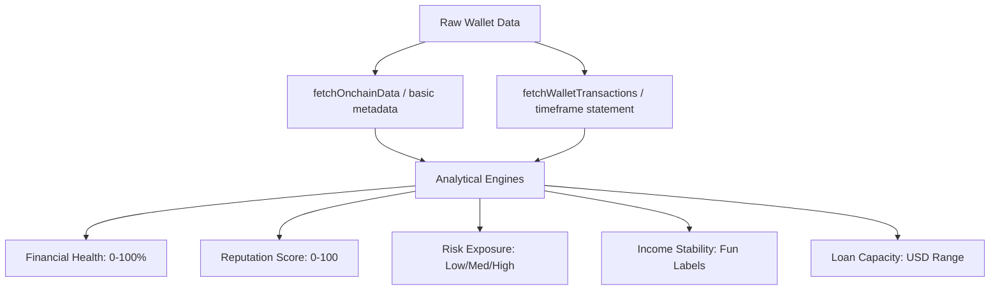

# ChainScore AI: Scoring Engine & Methodology Specification

This document provides a detailed technical explanation of the scoring algorithms, sub-dimension weights, metrics, and heuristics used by ChainScore AI to evaluate onchain financial profiles.

---

## 1. Core Architecture Overview

ChainScore AI consumes raw blockchain transaction lists, token balances, and protocol interaction history (on the Celo network) and passes them through a series of analytical layers to construct a creditworthiness and reputation profile.



---

## 2. Financial Health Score (0-100%)

The **Financial Health Score** is the core indicator of a wallet's financial discipline and stability. It is calculated as a weighted average of **six distinct sub-dimensions**:

| Sub-Dimension | Weight | Primary Ingested Metrics |
| :--- | :---: | :--- |
| **Income Stability** | 25% | Inflow recurrence consistency, variance in timing |
| **Savings Discipline** | 20% | Stablecoin ratio, net balance retention |
| **Portfolio Risk** | 20% | Volatile assets ratio |
| **Spending Discipline** | 15% | Ratio of total outflow to total inflow |
| **Wallet Maturity** | 10% | Wallet age (months), protocol interaction diversity |
| **Debt & Risk Signals** | 10% | Leverage history, liquidation risk, speculative flags |

### Sub-Dimension Calculation Details

#### A. Income Stability (25% Weight)
Measures the predictability and consistency of inflows over time.
- **Algorithm**:
  1. Filters transactions where `type = "inflow"`.
  2. If 0 inflows, score = `10%`.
  3. If 1 inflow, score = `30%` (low stability due to insufficient history).
  4. If multiple inflows, calculates intervals (in days) between consecutive inflows:
     $$\text{Consistency Ratio} = \frac{\text{Standard Deviation of Inflow Intervals}}{\text{Average Inflow Interval}}$$
  5. Assigns score based on the Consistency Ratio:
     - $\text{Ratio} < 0.2$ (highly regular/salary-like) $\rightarrow$ **95%**
     - $\text{Ratio} < 0.5$ (very consistent) $\rightarrow$ **80%**
     - $\text{Ratio} < 1.0$ (moderately consistent) $\rightarrow$ **60%**
     - $\text{Ratio} \ge 1.0$ (volatile/unpredictable) $\rightarrow$ **40%**

#### B. Savings Discipline (20% Weight)
Evaluates whether the wallet acts as a pipeline (assets immediately drained) or a reservoir (capital retained).
- **Algorithm**:
  1. Computes the stablecoin ratio relative to the total portfolio:
     $$\text{Stablecoin Ratio} = \frac{\text{Stablecoin Balance}}{\text{Stablecoin Balance} + \text{Volatile Balance}}$$
  2. Assigns a score blending stablecoin ratio and total balance:
     $$\text{Savings Score} = \min(100, \text{round}(\text{Stablecoin Ratio} \times 70 + \min(30, \frac{\text{Total Balance}}{200})))$$
  3. If total balance is 0, score = `10%`.

#### C. Portfolio Risk (20% Weight)
Quantifies exposure to highly volatile price movements.
- **Algorithm**:
  - Compares stable vs. volatile asset distributions:
    $$\text{Portfolio Risk Score} = \text{round}((1 - \text{Volatile Asset Ratio}) \times 100)$$
  - *Result*: A wallet containing 100% stablecoins receives a score of **100%** (lowest asset risk), while a wallet containing 100% speculative volatile tokens receives **0%** (highest asset risk).

#### D. Spending Discipline (15% Weight)
Examines the net cash flow of the wallet by comparing inflows vs. outflows.
- **Algorithm**:
  1. Sums all inflow values ($\text{Inflow}_{\text{total}}$) and outflow values ($\text{Outflow}_{\text{total}}$).
  2. Calculates the outflow ratio:
     $$\text{Outflow Ratio} = \frac{\text{Outflow}_{\text{total}}}{\text{Inflow}_{\text{total}}}$$
  3. Assigns score:
     - $\text{Outflow Ratio} \le 0.3$ $\rightarrow$ **95%** (exceptional retention)
     - $\text{Outflow Ratio} \le 0.6$ $\rightarrow$ **85%**
     - $\text{Outflow Ratio} \le 0.9$ $\rightarrow$ **70%** (healthy balance)
     - $\text{Outflow Ratio} \le 1.1$ $\rightarrow$ **50%**
     - $\text{Outflow Ratio} > 1.1$ $\rightarrow$ $\max(10, \text{round}(100 - (\text{Outflow Ratio} \times 30)))$ (living beyond means)

#### E. Wallet Maturity (10% Weight)
Measures the experience and age of the user within the decentralized ecosystem.
- **Algorithm**:
  - Split into two factors:
    - **Age Factor** (max 60 points): $\min(60, \frac{\text{Wallet Age in Months}}{48} \times 60)$
    - **Protocol Factor** (max 40 points): $\min(40, \text{Unique Protocols Used} \times 10)$
  - $$\text{Wallet Maturity Score} = \text{round}(\text{Age Factor} + \text{Protocol Factor})$$

#### F. Debt & Risk Signals (10% Weight)
Calculates exposure to debt and speculative smart contracts.
- **Algorithm**:
  - Starts at a base of `100%`.
  - Deducts `20%` if volatile asset exposure is $> 80\%$.
  - Deducts `10%` if the wallet has active interactions with money markets (e.g., Aave) representing potential leverage debt.

---

## 3. Wallet Reputation Score (0-100)

Separate from financial health, the **Reputation Score** measures wallet security, trustworthiness, and historical legitimacy. It starts at a base of **50 points** and applies bonuses and penalties:

```
[Base Score: 50]
   + [Age Bonus: +1 per month, max 30]
   + [Protocol Bonus: +5 per trusted protocol, max 15]
   + [Tx Volume Consistency: +5 for >10 txs, +10 for >20 txs]
   - [Suspicious Contract Interaction Penalty: -25]
   - [Flashloan / speculatively active profile Penalty: -15]
============================================================
Total Reputation Score (bounded 0 to 100)
```

### Trust Classification Ranges
- **$\ge$ 85**: Established Wallet (low counterparty risk)
- **70 to 84**: Trusted DeFi User
- **50 to 69**: Moderate Reputation Wallet
- **$<$ 50**: High Risk / Unverified Wallet (highly speculative or flagged interactions)

---

## 4. Risk Exposure Analysis

Categorizes the asset allocation of the wallet into four sectors:
1. **Stablecoin %**: Allocation in mental stable currencies (cUSD, USDC, KESm, etc.).
2. **Volatile Asset %**: Allocation in native assets (CELO, WETH, WBTC).
3. **DeFi Exposure %**: LP token holdings or yield-bearing positions.
4. **NFT Exposure %**: Estimated capital held in NFT inventories ($100 per NFT heuristic).

### Risk Classification Category
- **Low Risk**: $\ge 70\%$ stablecoin allocation.
- **High Risk**: $> 60\%$ volatile asset allocation OR $> 30\%$ NFT exposure.
- **Medium Risk**: Default balanced allocations.

---

## 5. Income Stability (Fun Labels)

Assigns a descriptive financial persona category using inflow statistics:

- **Whale Activity**: Total portfolio value $> \$100,000$ USD OR average inflow size $> \$15,000$ USD.
- **Stable Earner**: Weekly inflow consistency $\ge 75\%$.
- **Growing Wallet**: Inflow history $\ge 3$ months, $\ge 6$ inflows, and the average inflow of the second half of transactions is at least $20\%$ higher than the first half.
- **Seasonal Earner**: Inflow history $\ge 3$ months, $\ge 6$ inflows, but inflows lack steady week-on-week frequency.
- **Dormant Wallet**: Wallet age $> 3$ months with $\le 2$ total inflows.
- **Volatile Income**: Default categorization for irregular, intermittent cash flows.

---

## 6. Estimated Loan Capacity (USD)

Calculates the safe borrowing limit that the wallet can repay without liquidity distress.

### Formulas
1. **Base Capacity**: 30% of the estimated monthly inflow.
   $$\text{Base Capacity} = \text{Monthly Inflow} \times 0.30$$
2. **Consistency Modifier**: Adjusts capacity based on weekly inflow consistency (0 to 1 ratio).
   $$\text{Base Capacity} = \text{Base Capacity} \times (0.50 + 0.50 \times \text{Consistency})$$
3. **Risk Modifier**: Adjusts capacity based on risk classification.
   - Low Risk: **1.2x** multiplier
   - Medium Risk: **0.8x** multiplier
   - High Risk: **0.4x** multiplier
4. **Liquidity Booster**: Adds 10% of stablecoin holdings to borrow capability.
   $$\text{Final Capacity} = \text{Final Capacity} + (\text{Stablecoin Balance} \times 0.10)$$
5. **Loan Range**:
   - Minimum Safe Limit: $\text{Final Capacity} \times 0.70$
   - Maximum Safe Limit: $\text{Final Capacity} \times 1.30$

### Safe Borrowing Range Confidence Levels
- **High**: Wallet age $> 24$ months AND weekly consistency $> 80\%$.
- **Low**: Wallet age $< 6$ months OR weekly consistency $< 40\%$.
- **Medium**: Standard default range.

---

## 7. Lipa Mdogo Mdogo 3-Month Cash Flow Statement

ChainScore incorporates a dedicated **3-Month Cash Flow Statement** designed to match the verification standard used by micro-finance pay-as-you-go providers (such as device financing providers in East Africa):
- **3-Month Inflow**: Sum of all inflows over the last 90 days.
- **3-Month Outflow**: Sum of all outflows over the last 90 days.
- **Net Cash Flow**: Inflow minus Outflow.
- **Micro-repayment Eligibility Status**:
  - *Highly Eligible*: Wallet is classified as a "Stable Earner" or "Whale Activity".
  - *Eligible*: Wallet is classified as a "Growing Wallet" or "Seasonal Earner".
  - *Needs Review*: Default for volatile or dormant income profiles.
